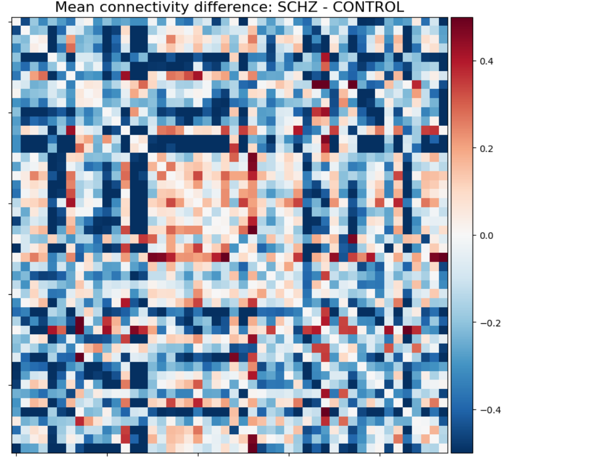
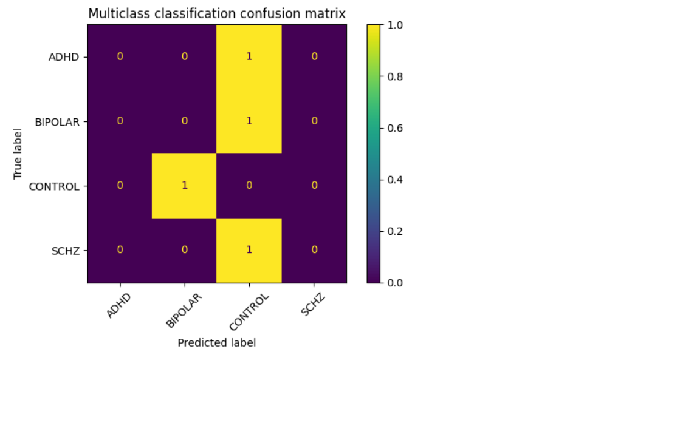
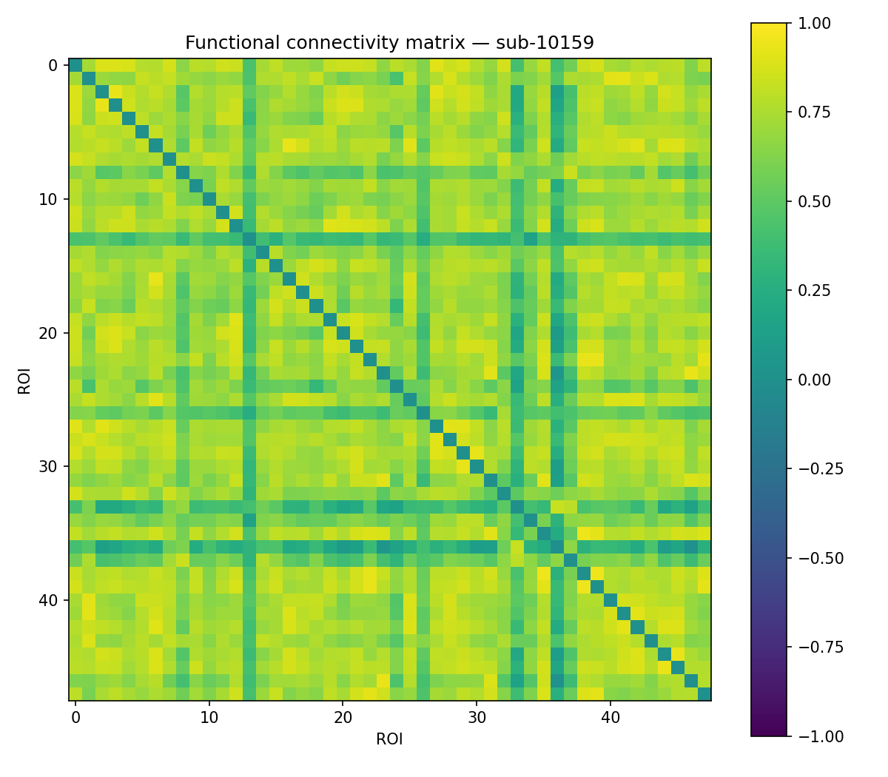

# Psychiatric Brain Connectivity Analysis

[](https://github.com/kva99kva-eng/psychiatric-brain-connectivity-analysis/actions/workflows/tests.yml)

Resting-state fMRI functional connectivity analysis across psychiatric diagnostic groups using the UCLA Consortium for Neuropsychiatric Phenomics dataset.

This project is designed as an educational neuroscience / neuroimaging analytics case study. It demonstrates how to structure an exploratory functional connectivity workflow, apply multiple-comparison correction, and evaluate a simple baseline classifier while clearly documenting limitations.

## Executive Summary

This project demonstrates a small-scale exploratory pipeline for psychiatric brain connectivity analysis.

The strongest part of the project is not model performance, but the research workflow:

- define a neuroscience question;
- load and inspect neuroimaging metadata;
- build or load ROI-based functional connectivity matrices;
- compare connectivity patterns across diagnostic groups;
- run exploratory permutation testing;
- apply Benjamini-Hochberg FDR correction;
- train a simple baseline classifier with leakage-safe preprocessing;
- explicitly state why results should not be interpreted as diagnostic or clinical claims.

## Problem Statement

Psychiatric disorders may be associated with differences in functional brain connectivity.

This project explores resting-state fMRI functional connectivity patterns across psychiatric and control groups using the UCLA Consortium for Neuropsychiatric Phenomics dataset.

The goal is to build an educational neuroscience data analysis pipeline, not a clinical diagnostic tool.

## Dataset

This project is based on the UCLA Consortium for Neuropsychiatric Phenomics dataset, available through OpenNeuro as `ds000030`.

The dataset includes participants from several groups, including:

- healthy controls;
- schizophrenia;
- bipolar disorder;
- ADHD.

Large neuroimaging files are not stored in this repository. Local data should be placed in the `data/` directory according to the project instructions.

## Analysis Workflow

The project follows this workflow:

1. Inspect metadata and diagnostic group structure.
2. Download or load preprocessed resting-state fMRI data.
3. Extract ROI time series using an anatomical atlas.
4. Compute ROI-to-ROI Pearson correlation connectivity matrices.
5. Vectorize upper-triangle connectivity edges.
6. Compare groups using exploratory permutation testing.
7. Apply FDR correction across connectivity edges.
8. Train a simple baseline classifier using Leave-One-Out cross-validation.
9. Interpret results cautiously because of small sample size.

## Methods

- Resting-state fMRI analysis
- ROI-based functional connectivity
- Harvard-Oxford cortical atlas
- Pearson correlation connectivity matrices
- Group-level connectivity comparison
- Permutation testing
- Benjamini-Hochberg FDR correction
- Logistic Regression baseline
- Leave-One-Out cross-validation for tiny-sample demonstration

## Notebooks

| Notebook | Description |
|---|---|
| `01_dataset_overview.ipynb` | Inspect dataset metadata and diagnostic groups |
| `02_connectivity_matrices.ipynb` | Build or load functional connectivity matrices |
| `03_group_connectivity_comparison.ipynb` | Compare connectivity matrices across groups |
| `04_statistical_testing.ipynb` | Run exploratory permutation testing and FDR correction |
| `05_ml_classification.ipynb` | Train a simple baseline classifier on connectivity features |

## Source Code

| File | Description |
|---|---|
| `src/connectivity.py` | Functions for downloading data, extracting ROI time series and computing connectivity matrices |
| `src/statistics.py` | Functions for vectorizing matrices, permutation testing and FDR correction |
| `src/modeling.py` | Functions for baseline machine learning classification |

## Quality and Reproducibility

This repository is structured as a reproducible research-style project rather than a notebook-only experiment.

| Component | Purpose |
|---|---|
| `src/` | Reusable Python modules for connectivity, statistics and modeling |
| `tests/` | Unit tests for core utility functions |
| GitHub Actions | Automatic test execution on push and pull request |
| `notebooks/` | Step-by-step exploratory analysis workflow |
| `assets/` and `reports/figures/` | Saved visual outputs used in the README |
| `.gitignore` | Keeps local environments, cache files and large data out of the repository |

Current local test status:

`10 passed`

## Project Structure

```text
psychiatric-brain-connectivity-analysis/
|-- .github/
|   `-- workflows/
|       `-- tests.yml
|-- assets/
|   |-- group_connectivity_difference.png
|   `-- ml_classification_results.png
|-- data/
|-- notebooks/
|-- reports/
|-- src/
|   |-- __init__.py
|   |-- connectivity.py
|   |-- modeling.py
|   `-- statistics.py
|-- tests/
|   |-- test_connectivity.py
|   |-- test_modeling.py
|   `-- test_statistics.py
|-- .gitattributes
|-- .gitignore
|-- LICENSE
|-- README.md
`-- requirements.txt
```


## Key Analytical Decisions

### 1. Connectivity matrices instead of raw voxel modeling

The project uses ROI-based connectivity matrices rather than raw voxel-level modeling. This makes the analysis more interpretable and more suitable for a small educational project.

### 2. Upper-triangle vectorization

Connectivity matrices are symmetric. Only the upper triangle is used as a feature vector to avoid duplicate edges.

### 3. Permutation testing

Permutation testing is used for exploratory group comparison because small-sample neuroimaging data often violates parametric assumptions.

### 4. FDR correction

Benjamini-Hochberg FDR correction is applied to reduce false positives across many connectivity edges.

### 5. Leakage-safe ML pipeline

The baseline Logistic Regression model uses `StandardScaler` inside a scikit-learn `Pipeline`, so scaling is fitted inside cross-validation folds rather than on the whole dataset.

## Results

The project demonstrates a complete exploratory workflow for psychiatric brain connectivity analysis.

The main value of the project is not high model performance, but the ability to build a reproducible research pipeline:

- ROI-level functional connectivity matrices are generated from resting-state fMRI data;
- symmetric connectivity matrices are converted into upper-triangle feature vectors;
- group differences are explored using permutation-based testing;
- multiple-comparison risk is addressed with Benjamini-Hochberg FDR correction;
- a simple baseline classifier is evaluated with leakage-safe preprocessing.

The results should be interpreted cautiously because this repository uses a small local validation subset. The statistical testing and machine learning sections are included to demonstrate methodology, not to make clinical or diagnostic claims.

## Visual Results

### Group connectivity difference



### Baseline ML classification results



### Example subject-level connectivity matrix



## Key Findings

- The project shows how raw neuroimaging data can be transformed into interpretable ROI-to-ROI connectivity features.
- Upper-triangle vectorization reduces redundant information and makes connectivity matrices usable for statistical testing and machine learning.
- Permutation testing is more appropriate for this small exploratory setup than relying only on parametric assumptions.
- FDR correction is necessary because connectivity analysis involves many pairwise ROI comparisons.
- The ML model should be treated as a baseline demonstration, not as evidence of clinical diagnostic performance.
- The most important outcome is a transparent and reproducible research workflow with explicit limitations.

## How to Run

Clone the repository:

```bash
git clone https://github.com/kva99kva-eng/psychiatric-brain-connectivity-analysis.git
cd psychiatric-brain-connectivity-analysis
```

Create and activate a virtual environment:

```bash
python -m venv .venv
```

Windows PowerShell:

```bash
.\.venv\Scripts\Activate.ps1
```

Install dependencies:

```bash
pip install -r requirements.txt
```

Run Jupyter Lab:

```bash
jupyter lab
```

Then run the notebooks in order from `01` to `05`.

## Validation and Interpretation

This project should be treated as a methodology demonstration.

The machine learning section is not intended to prove diagnostic separability between groups. With small sample sizes, model scores can be unstable and sensitive to the specific subjects included in the validation subset.

The correct interpretation is:

- the pipeline demonstrates how connectivity features can be extracted and analyzed;
- statistical testing demonstrates an exploratory workflow;
- ML classification demonstrates baseline methodology;
- results are not validated biomarkers.

## Limitations

This project uses a simplified educational workflow and a very small local validation subset.

It does not provide:

- clinical diagnosis;
- validated biomarkers;
- population-level statistical conclusions;
- production-grade neuroimaging preprocessing;
- large-sample model validation;
- medical recommendations.

The statistical and machine learning results should be interpreted as pipeline demonstrations only.

## Future Work

- Add a larger reproducible subject subset.
- Add confound checks for age, sex and motion where metadata is available.
- Add more robust preprocessing documentation.
- Add nested cross-validation for any future ML model selection.
- Add model comparison only after increasing the validation sample size.
- Add more detailed reporting of statistically corrected connectivity edges.


## Tech Stack

- Python
- NumPy
- pandas
- Matplotlib
- SciPy
- scikit-learn
- Nilearn
- NiBabel
- Jupyter Lab

## Resume Summary

Built an exploratory resting-state fMRI connectivity pipeline using the UCLA CNP dataset. Implemented ROI-based connectivity extraction, group comparison, permutation testing, FDR correction and leakage-safe baseline classification with clear clinical limitations.

## License

This project is licensed under the MIT License.
